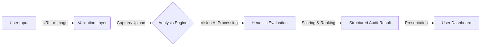

# UXAudit AI 🧠
> **Turn user friction into conversion.**  
> *AI-powered UX audits that identify distinct conversion blockers in seconds.*


[](https://opensource.org/licenses/MIT)
[]()
[]()

---

## 🔍 What is UXAudit AI?

**UXAudit AI** is a specialized Micro-SaaS tool designed to eliminate the guesswork from Conversion Rate Optimization (CRO).

Founders and marketers often stare at their landing pages, knowing *something* is wrong but not exactly *what*. Traditional audits require expensive consultants (weeks) or generic SEO tools (that miss visual psychology).

**UXAudit AI bridges this gap.** It uses advanced Vision LLMs to "see" your website like a human expert would—analyzing visual hierarchy, copy clarity, and friction points—delivering actionable, prioritized fixes instantly.

---

## 🚀 Core Features

| Feature | Description |
| :--- | :--- |
| **📸 Screenshot Analysis** | Upload any UI mockups or screenshots (PNG/JPG) for instant feedback. |
| **🔗 URL Auditing** | Enter a live URL to capture and analyze the current state of your webpage. |
| **📊 UX Scoring System** | Get a quantifiable **0–100 UX Score** based on industry heuristics. |
| **🚦 Issue Prioritization** | Findings are categorized by severity (**High**, **Medium**, **Low**) so you know what to fix first. |
| **💡 Actionable Steps** | No vague theory. Get specific "Fix It" steps for every identified issue. |
| **⚡ Quick Wins** | A dedicated section for low-effort, high-impact changes you can make immediately. |
| **📄 Report Generation** | Export comprehensive findings as **JSON** or view a beautiful **HTML Report**. |

---

## ⚙️ How It Works

The system follows a streamlined analysis pipeline to ensure high-quality, reproducible results.



1.  **Input**: User provides a URL or uploads a design file.
2.  **Capture**: The system captures a high-res screenshot (headless browser) or processes the uploaded file.
3.  **Analysis**: The image is fed into our Vision AI pipeline with specific context constraints.
4.  **Evaluation**: The AI applies strict UX heuristics (Nielsen’s 10 Heuristics + CRO best practices).
5.  **Result**: A structured audit is generated, saved, and presented with a score and priority list.

---

## 🏗️ Architecture Overview

UXAudit AI is built using **Clean Layered Architecture** to ensure detailed separation of concerns, testability, and scalability.

```
src/
├── presentation/    (UI Components, Pages, Styles)
│   └── Responsible for rendering data and capturing user intent.
├── application/     (Use Cases, Ports)
│   └── Orchestrates business logic (e.g., RunAudit, SaveResult).
├── domain/          (Entities, Rules)
│   └── Pure business rules and validation schemas.
└── infrastructure/  (AI, Database, Capture)
    └── External implementations (Supabase, Anthropic, Puppeteer).
```

---

## 🛠️ Tech Stack

### Frontend
*   **Framework**: Next.js 14 (App Router)
*   **Language**: TypeScript
*   **Styling**: Tailwind CSS + CSS Variables
*   **State**: React Server Components + Client Hooks

### Backend & Infrastructure
*   **Runtime**: Node.js (Next.js API Routes / Server Actions)
*   **Database**: Supabase (PostgreSQL)
*   **Storage**: Supabase Storage (S3-compatible)
*   **AI Engine**: Anthropic Claude 3.5 Sonnet (Vision) capabilities
*   **Validation**: Zod

---

## 📂 Project Structure

```bash
/src
  /app              # Next.js App Router (Presentation)
  /presentation     # Shared UI components & hooks
  /application      # Application business logic (Use Cases)
    /ports          # Interfaces for external services
    /usecases       # e.g. AuditFromImage.ts
  /domain           # Domain entities & business rules
  /infrastructure   # Adapters (Supabase, AI Provider)
  /shared           # Config, Utils, types
```

---

## ⚡ Getting Started (Developer)

Follow these steps to run UXAudit AI locally.

### 1. Prerequisites
*   Node.js 18+
*   npm or pnpm
*   Supabase Account (for DB & Storage)

### 2. Installation

```bash
git clone https://github.com/your-org/uxaudit-ai.git
cd uxaudit-ai
npm install
```

### 3. Environment Variables
Create a `.env.local` file in the root directory:

```bash
# App
NEXT_PUBLIC_APP_URL=http://localhost:3000

# AI Provider (Anthropic)
AI_API_KEY=sk-ant-...

# Supabase (Auth & Database)
NEXT_PUBLIC_SUPABASE_URL=https://your-project.supabase.co
NEXT_PUBLIC_SUPABASE_ANON_KEY=public-anon-key...
SUPABASE_SERVICE_ROLE_KEY=service-role-key...

# Feature Flags
AI_MOCK_MODE=false # Set to true to save credits dev
```

### 4. Run Locally

```bash
npm run dev
```
Open [http://localhost:3000](http://localhost:3000) to start auditing.

---

## 🧭 How to Use

### Auditing a Live Website
1.  Go to the **Home** page.
2.  Switch the toggle to **"Website URL"**.
3.  Paste the full URL (e.g., `https://example.com`) and click **"Audit Now"**.
4.  Wait ~15-30 seconds for the capture and analysis.

### Auditing a Design / Screenshot
1.  On the **Home** page, select **"Upload Screenshot"**.
2.  Drag & drop your PNG/JPG file (max 5MB).
3.  Click **"Analyze Screenshot"**.
4.  Success! You will be redirected to the detailed report page.

---

## 📊 Audit Result Format

The system provides a comprehensive breakdown:

*   **UX Score (0-100)**: A weighted aggregate of usability, clarity, and aesthetics.
*   **Score Breakdown**: Sub-scores for *Visual Hierarchy*, *Conversion*, *Copy*, *Layout*, and *Accessibility*.
*   **Issues List**: Detailed problems containing:
    *   **Evidence**: "The 'Sign Up' button blends into the hero background."
    *   **Recommendation**: "Change the button color to #FF5733 to increase contrast ratio > 4.5:1."
    *   **Impact**: High/Medium/Low.

---

## 🗺️ Roadmap

*   [x] MVP: Image & URL Audits
*   [x] Core Scoring Engine
*   [ ] User Authentication & History
*   [ ] PDF Export (Currently HTML/JSON)
*   [ ] Competitor Comparison Mode
*   [ ] Chrome Extension

---

## ⚖️ Philosophy & Disclaimer

**UXAudit AI is a decision-support tool.**

While our heuristics are based on battle-tested CRO principles, AI can sometimes hallucinate or miss context nuances (like specific brand guidelines). Use these audits as a **high-fidelity second opinion** to speed up your optimization process, not as a replacement for user testing with real humans.

---

## 📝 License

This project is licensed under the **MIT License**. See the `LICENSE` file for details.

---

Built with ❤️ by the **UXAudit AI Team**.
